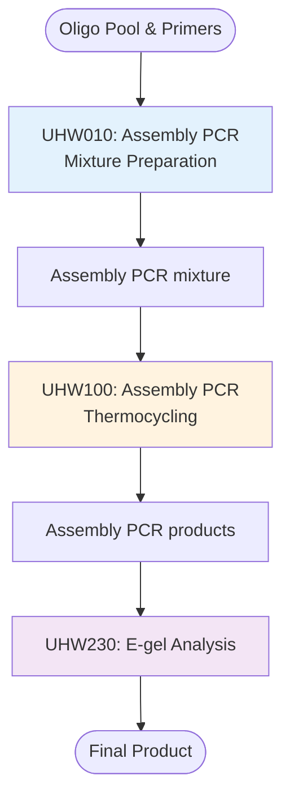
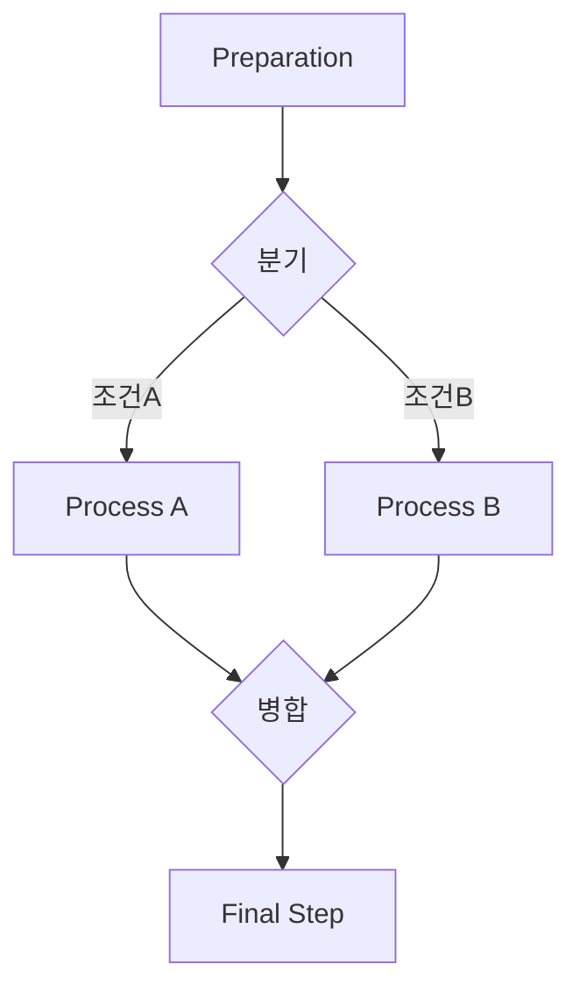
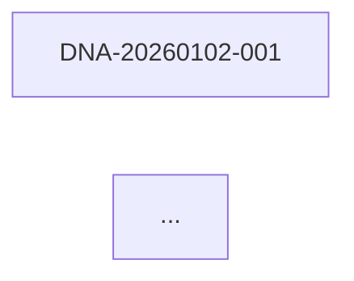
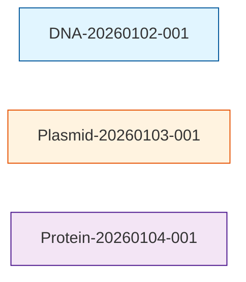
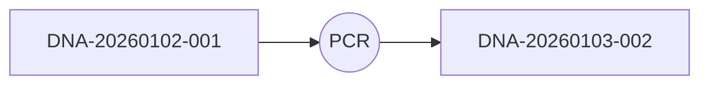

# K-BioFoundry Workflow Diagram Generator

이 skill은 연구노트의 Input-Output 관계를 분석하여 Mermaid 다이어그램으로 workflow를 시각화합니다.

## 주요 기능

1. **Input-Output 자동 추출**: 노트의 Input/Output 섹션에서 샘플 ID 파싱
2. **Mermaid Flowchart 생성**: 샘플 간 연결 관계를 flowchart로 표현
3. **시간순 정렬**: 날짜 기반으로 workflow 흐름 구성
4. **이미지 변환**: Mermaid diagram을 PNG/SVG로 변환 (선택)

## 사용 시점

- "Workflow 다이어그램 그려줘"
- "샘플 흐름 보여줘"
- "실험 연결 구조 시각화해줘"
- Input-Output 관계를 시각적으로 확인하고 싶을 때

---

## 작업 절차

### 1. 대상 노트 식별

**기본 동작: 하나의 .md 파일 = 하나의 workflow**

- **현재 열린 파일**: 사용자가 보고 있는 랩노트 파일 분석 (기본값)
- **지정된 파일**: 사용자가 명시한 특정 .md 파일 하나 분석
- **여러 파일 추적 (고급)**: 사용자가 명시적으로 요청한 경우만
  - 여러 노트 간 샘플 추적
  - 특정 기간의 모든 노트
  - 특정 샘플 중심 추적

### 2. Unit Operation 및 Input/Output 파싱

**단일 파일 내에서 각 Unit Operation (UO)의 Input과 Output 추출:**

```markdown
### [UHW010 Liquid Handling] Assembly PCR mixture preparation
#### Input
- Resuspended oligo pool stock solution (1 pmol/μL)
- Outer primers (overlap_F1, overlap_R1)

#### Output
- Assembly PCR reaction mixture (10 μL per tube) * 6

### [UHW100 Thermocycling] Assembly PCR reaction
#### Input
- Assembly PCR reaction mixture (from previous step, PCR tube, 10 μL per tube)

#### Output
- Assembly PCR products (PCR tube, 10 μL per tube)
```

추출 대상:
- **Unit Operation 이름**: [UO코드 카테고리] 실험명
- **Input/Output 제품**: 각 단계의 입출력 물질
- **Sample ID** (있는 경우): 패턴 매칭 (DNA-YYYYMMDD-NNN 등)
- **설명**: 괄호 안 정보 (용량, 농도, 크기 등)

### 3. 워크플로우 그래프 구성

**단일 파일 내 Unit Operation 간 연결 관계 구성:**

```python
{
  "workflow": "WB010 DNA Oligomer Assembly",
  "unit_operations": [
    {
      "nUnit Operation 중심 Flowchart (위→아래)

**단일 워크플로우 파일 내 UO 간 흐름 표현:**



#### 분기/병합이 있는 복잡한 워크플로우



#### 노드 정보 포함

- **UO 노드**: 실험 단계 표시
- **중간 산물**: 각 단계의 Output
- **분기점**: 조건별 경로 분리
- **QC 단계**: 품질 확인 단계 (점선)
- **색상 구분**: UO 카테고리별 색상

엣지 정보:workflow.py

**단일 워크플로우 파일에서 Unit Operation 추출:**

```python
#!/usr/bin/env python3
"""
단일 워크플로우 노트에서 Unit Operation 및 Input/Output 파싱

Usage:
    python parse_workflow.py --file labnote.md --output workflow_data.json
"""

import re
import json
from pathlib import Path

def parse_unit_operation(uo_text):
    """하나의 Unit Operation 섹션 파싱"""
    # UO 이름 추출
    uo_match = re.search(r'###\s*\[([^\]]+)\]\s*(.+)', uo_text)
    if not uo_match:
        return None
    
    uo_code = uo_match.group(1)
    uo_name = uo_match.group(2).strip()
    
    # Input 추출
    inputs = []
    input_match = re.search(r'####\s*Input\s*\n(.*?)(?=####)', uo_text, re.DOTALL)
    if input_match:
        for line in input_match.group(1).split('\n'):
            if line.strip().startswith('-'):
                inputs.append(line.strip('- ').strip())
    
    # Output 추출
    outputs = []
    output_match = re.search(r'####\s*Output\s*\n(.*?)(?=####)', uo_text, re.DOTALL)
    if output_match:
        for line in output_match.group(1).split('\n'):
            if line.strip().startswith('-'):
                outputs.append(line.strip('- ').strip())
    
    return {
        'code': uo_code,
        'name': uo_name,
        'inputs': inputs,
        'outputs': outputs
    }

def parse_workflow_file(file_path):
    """전체 워크플로우 파일 파싱"""
    with open(file_path, 'r', encoding='utf-8') as f:
        content = f.read()
    
    # Workflow 메타데이터
    title_match = re.search(r'title:\s*(.+)', content)
    date_match = re.search(r'created_date:\s*["\'](\d{4}-\d{2}-\d{2})', content)
    
    # Unit Operation 섹션 분리
    uo_sections = re.split(r'\n### \[', content)
    unit_operations = []
    
**워크플로우 다이어그램 생성:**

```python
#!/usr/bin/env python3
"""
단일 워크플로우의 Mermaid diagram 생성

Usage:
    python generate_diagram.py --data workflow_data.json --output workflow.md
"""

import json
import argparse

def generate_workflow_diagram(workflow_data, direction='TD'):
    """Unit Operation 중심 flowchart 생성"""
    
    mermaid = [f"flowchart {direction}"]
    unit_ops = workflow_data['unit_operations']
    
    # 첫 UO의 Input을 시작 노드로
    if unit_ops and unit_ops[0]['inputs']:
        start_inputs = '<br/>'.join(unit_ops[0]['inputs'][:2])  # 처음 2개만
        mermaid.append(f'    Start([{start_inputs}]) --> UO1')
        mermaid.append('')
    
    # Unit Operation 노드 생성
    for i, uo in enumerate(unit_ops, 1):
        uo_id = f"UO{i}"
        uo_label = f"{uo['code']}: {uo['name']}"
        mermaid.append(f'    {uo_id}[{uo_label}]')
        
        # Output 중간 노드 (필요시)
        if uo['outputs']:
            output_text = uo['outputs'][0][:50]  # 첫 output, 50자 제한
            mermaid.append(f'    {uo_id} --> Out{i}[{output_text}]')
            
            # 다음 UO로 연결
            if i < len(unit_ops):
                mermaid.append(f'    Out{i} --> UO{i+1}')
        
        mermaid.append('')
    
    # 최종 산물
    if unit_ops and unit_ops[-1]['outputs']:
        last_output = unit_ops[-1]['outputs'][0][:50]
        mermaid.append(f'    Out{len(unit_ops)} --> Final([{last_output}])')
        mermaid.append('')
    
    # 스타일 적용
    mermaid.append('    style Start fill:#e1f5e1')
    mermaid.append('    style Final fill:#ffe1e1')
    
    # UO 카테고리별 색상
    color_map = {
        'Liquid Handling': '#e3f2fd',
        'Thermocycling': '#fff3e0',
        'Fragment Analysis': '#f3e5f5',
        'Incubation': '#fff3e0',
        'Sealing': '#e0f7fa',
        'Centrifuge': '#e0f7fa'
    }
    
    for i, uo in enumerate(unit_ops, 1):
        for category, color in color_map.items():
            if category in uo['code']:
                mermaid.append(f'    style UO{i} fill:{color}')
                break
    return '\n'.join(mermaid)

def generate_mermaid_timeline(notes_data):
    """Timeline 스타일 다이어그램 생성"""
    
    mermaid = ["flowchart TD"]
    
    # 날짜별 그룹화
    by_date = {}
    for note in notes_data:
        date = note['date']
        if date not in by_date:
            by_date[date] = []
        by_date[date].append(note)
    
    # 날짜순 정렬
    sorted_dates = sorted(by_date.keys())
    
    # 서브그래프로 날짜별 노드 생성
    for date in sorted_dates:
        mermaid.append(f'    subgraph "{date}"')
        
        for note in by_date[date]:
            for output in note['outputs']:
                sample_id = output['id']
                node_id = sample_id.replace('-', '_')
                label = output['text'].replace(sample_id, '').strip(' -()')
                mermaid.append(f'        {node_id}["{sample_id}<br/>{label}"]')
        
        mermaid.append('    end')
        mermaid.append('')
    
    # 엣지 연결
    for note in notes_data:
        for output in note['outputs']:
            output_id = output['id'].replace('-', '_')
            for input_item in note['inputs']:
                input_id = input_item['id'].replace('-', '_')
                mermaid.append(f'    {input_id} --> {output_id}')
    
    return '\n'.join(mermaid)
```

#### 스크립트 3: render_diagram.py (선택)

Mermaid를 이미지로 변환 (mermaid-cli 필요):

```python
#!/usr/bin/env python3
"""
Mermaid diagram을 이미지로 렌더링

Requirements:
    npm install -g @mermaid-js/mermaid-cli

Usage:
    python render_diagram.py --input workflow.mmd --output workflow.png
"""

import subprocess
import argparse

def render_mermaid(input_file, output_file, format='png'):
    """mmdc 명령으로 Mermaid 렌더링"""
    
    cmd = ['mmdc', '-i', input_file, '-o', output_file]
    
    if format == 'svg':
        cmd.extend(['-b', 'transparent'])
    
    try:
        subprocess.run(cmd, check=True)
        print(f"✅ 다이어그램 생성: {output_file}")
    except subprocess.CalledProcessError as e:
        print(f"❌ 렌더링 실패: {e}")
    except FileNotFoundError:
        print("❌ mermaid-cli (mmdc)가 설치되어 있지 않습니다.")
        print("   설치: npm install -g @mermaid-js/mermaid-cli")
```

### 6. 출력 형식

#### .mmd 파일 (Mermaid 소스)

직접 편집 가능한 Mermaid 코드

#### .md 파일 (마크다운 내장)

GitHub/VS Code에서 바로 볼 수 있는 마크다운:

````markdown
# Workflow Diagram


````

#### .png/.svg 파일 (이미지)

발표자료, 보고서에 사용 가능

### 7. 사용 예시

#### 기본: 현재 워크플로우 파일 다이어그램

```bash
# 1. 워크플로우 파싱
python parse_workflow.py --file labnotes/001_WB010_DNA_Oligomer_Assembly.md --output workflow_data.json

# 2. Mermaid 다이어그램 생성
python generate_diagram.py --data workflow_data.json --output workflow.md

# 3. 이미지 변환 (선택)
python render_diagram.py --input workflow.md --output workflow.png
```

#### Claude에게 직접 요청 (권장)

사용자가 랩노트를 열어둔 상태에서:
- "이 워크플로우 다이어그램 그려줘"
- "현재 파일의 UO 흐름 보여줘"
→ Claude가 자동으로 파싱하고 다이어그램을 노트에 삽입

#### 여러 파일 추적 (고급, 명시적 요청 시만)

```bash
# 특정 샘플 ID를 여러 노트에서 추적
python track_sample.py --sample DNA-20260102-001 --labnotes ./labnotes --output sample_flow.md
```

### 8. 고급 기능

#### 노드 색상 구분

샘플 타입별 색상 적용:



#### 실험 프로세스 노드 추가

샘플 사이에 실험 프로세스 표시:



#### 통계 정보 추가

다이어그램 하단에 통계 추가:

```
총 노트: 15개
총 샘플: 42개
실험 기간: 2025-12-01 ~ 2026-01-15
```

---

## 제약사항

- Mermaid는 복잡한 그래프에서 레이아웃이 자동 조정되므로 위치 제어 제한적
- 이미지 렌더링은 mermaid-cli (Node.js) 필요
- 매우 많은 샘플 (100개 이상)은 다이어그램이 복잡해질 수 있음

---

## 참고 자료

- Mermaid 공식 문서: https://mermaid.js.org/
- Mermaid Live Editor: https://mermaid.live/
- mermaid-cli: https://github.com/mermaid-js/mermaid-cli
