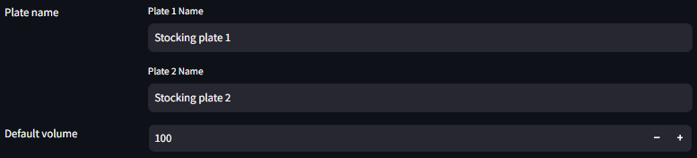
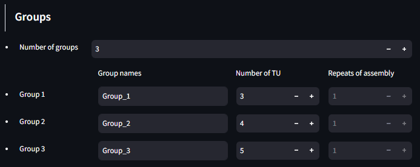
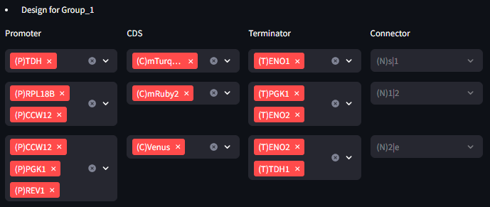
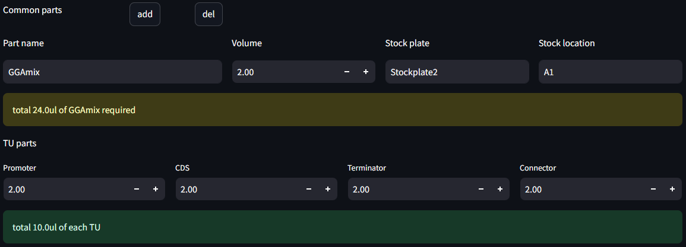
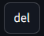
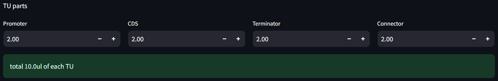
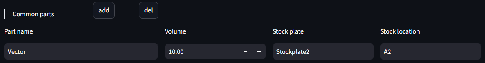
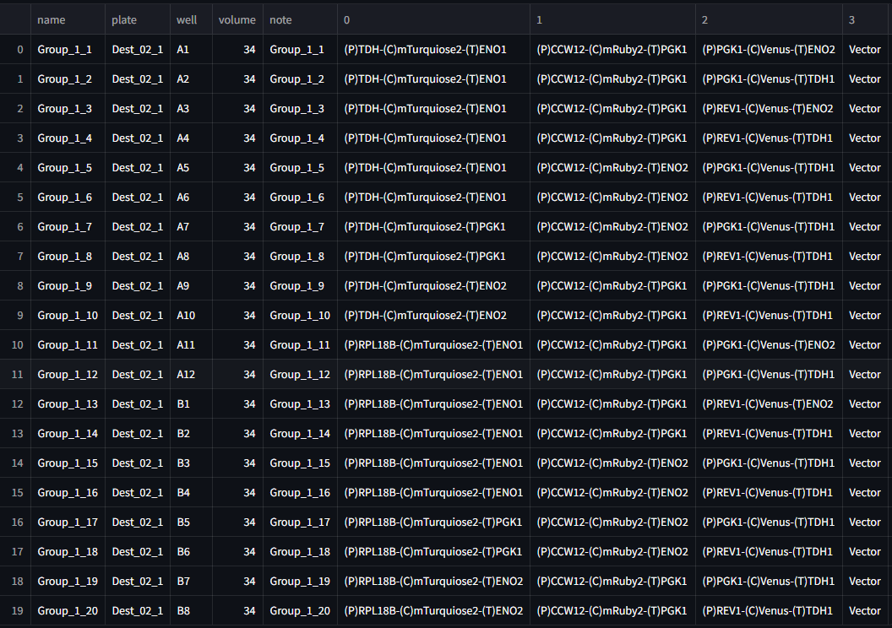

# Protogen

Protogen is a Streamlit application for automating liquid handling protocols for Opentrons OT-2 and Janus robotic systems.  
It generates protocols for DNA assembly and allows users to intuitively define components, volumes, and well positions.

## Features

- **Excel-based source plate loading**
- **Effimodular experimental design**
- **Automatic OT-2 and Janus protocol/mapping generation**
- **Required volume and plate feedback**

## Installation
Protogen is written in Python 3.9.

```sh
pip install streamlit pandas opentrons openpyxl
```

## Usage
Run the following command:

```sh
streamlit run protogen.py
```

### 1. File Upload (Input File Format)
Protogen uses Excel files (`.xlsx`) as input. Each sheet contains a table in a 96-well plate format, with the name of the corresponding component recorded in each well.

|    | 1  | 2  | 3  | ...  | 12|
|----|----|----|----|----|----|
| A  | (P)1 | (C)1 | (T)1 |    |
| B  | (P)2 | (C)2 | (T)2 |    |
| C  | (P)3 | (C)3 | (T)3 |    |
| ...|||||
| H  |(P)8|(C)8|(T)8|||  

- Each well (e.g., A1, B1, C1) contains the names of TU Parts such as Promoter, CDS, and Terminator.  
- Unused wells should be left empty.  
- Each Part is categorized using a header (P, C, T, N) at the beginning of its name, allowing the system to recognize Part positions automatically.  
- Parts with identical names are treated as the same Part.  

|Header|Part|
|----|---------|
|(P)| Promoter |
|(C)| CDS |
|(T)| Terminator |
|(N)| Connector |

### 2. Plate and Volume Settings
  

- Assign a name to each plate from the uploaded file.  
- Set a common volume for wells without volume data.  

### 3. Lv1 Design
#### Groups
  

This function enables multi-plasmid design. Each group is designed independently.  
- **Number of groups**: Defines the number of groups dividing the Transcription Unit (TU).  
- **Group names**: Assigns names to each group (duplicates may cause errors).  
- **Number of TU**: Specifies the number of TU each group contains.  

#### TU Design
  
- Defines detailed TU specifications for each group.  
- Each TU includes one CDS, and if multiple Promoters or Terminators are specified, all possible combinations are calculated to proceed with Lv2 Design.  
- Overlapping Part combinations are excluded.  
- Connectors are fixed.  

#### Volume Setting
  
- **Common parts**: Defines Parts to be included in all TU.  
    - Use  and  to add or remove Parts.  
    - Part names can be freely assigned, and the specified stock plate and stock location are used to load the corresponding Part.  
    - **If the Part name overlaps with an already loaded stock plate, conflicts may occur.**  
    - Entering the Name and Volume calculates the total required amount based on the number of Lv1 designs.  

  
- **TU Parts**: Sets the volume for each Part (unit: µL).  
    - The total volume for each TU is calculated after setting.  

### 4. Lv2 Assembly Design

- **Lv2 Volume Setting**: Defines the volume per TU and the dead volume for Lv2 assembly.  
    - Each combination includes the defined volume per TU.  
  
- **Common Parts**: Defines Parts to be included in all TU.  
    - Use  and  to add or remove Parts.  
    - Part names can be freely assigned, and the specified stock plate and stock location are used to load the corresponding Part.  
    - **If the Part name overlaps with an already loaded stock plate, conflicts may occur.**  
    - Entering the Name and Volume calculates the total required amount based on the number of Lv2 designs.  

##### Calculation Method  
Each TU contains one CDS. If multiple Promoters or Terminators are specified, all possible combinations are calculated to generate the Lv2 Design.  

- In the given example, 1+2\*2+3\*2 = 11 TU designs are created.  

  

### 5. Outputs
- **Select OT-2 or Janus**: Choose the robotic system to execute.  
- **Automatic protocol generation**: Generates OT-2 or Janus protocols based on selected settings.  
- **Check outputs**: Review final output well positions and used reagents.  
    - **OT-2 Protocol**: Python script formatted for execution on Opentrons.  
    - **Janus Protocol**: CSV mapping file for Hamilton Janus.  
    - **Updated inventory data**: Dataframe with updated volume calculations.  

